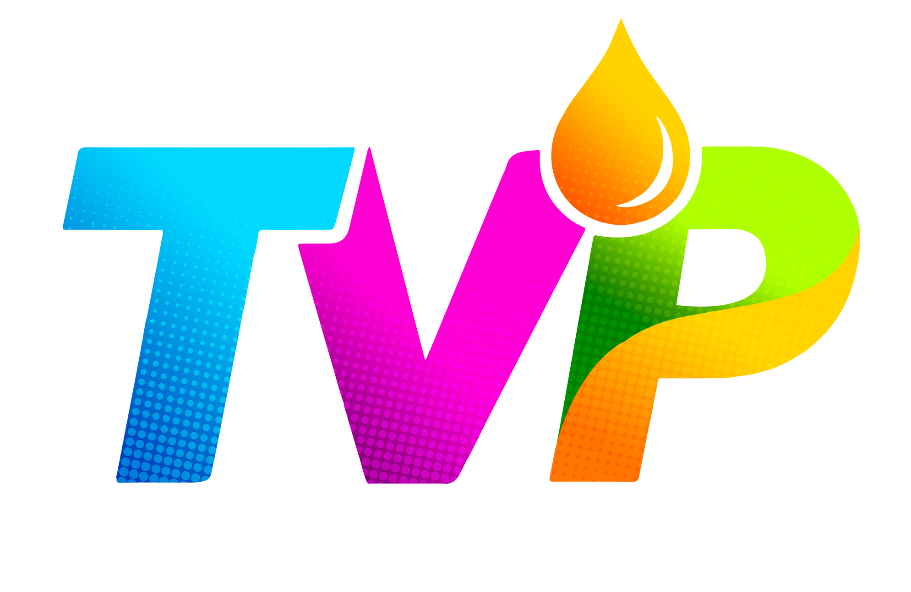

# Quick Fix Guide - Images & Videos Not Showing on Vercel

## ✅ What I Fixed (Already Done)

1. **Fixed `.gitignore`** - Removed merge conflict markers
2. **Optimized `vercel.json`** - Removed PHP, added proper routing
3. **Created `.vercelignore`** - Excludes unnecessary files

## ⚠️ What YOU Need to Fix (CRITICAL)

### Problem: Your SVG files are 1MB each because they have embedded PNG images inside them!

**Files affected:**
- `assets/images/logo.svg` (989 KB)
- `assets/images/footer-logo.svg` (843 KB)
- `assets/videos/hero-vid.mp4` (2.04 MB)

---

## Solution 1: Convert SVG to PNG (Easiest - 5 minutes)

### Step 1: Convert Images
1. Open `assets/images/logo.svg` in a browser
2. Take a screenshot or use an online converter: https://convertio.co/svg-png/
3. Save as `logo.png` (optimize to < 200KB using https://tinypng.com/)
4. Repeat for `footer-logo.svg`

### Step 2: Update HTML
In `index.html`, find these lines and change `.svg` to `.png`:

**Line 212:**
```html
<!-- Change from: -->


<!-- To: -->

```

**Line 902:**
```html
<!-- Change from: -->


<!-- To: -->

```

### Step 3: Deploy
```bash
git add .
git commit -m "Replace large SVG files with optimized PNG"
git push
```

---

## Solution 2: Use Cloudinary (Best for Production)

### Step 1: Sign up
1. Go to https://cloudinary.com (free tier is enough)
2. Sign up for a free account

### Step 2: Upload Files
1. Upload `logo.svg`, `footer-logo.svg`, and `hero-vid.mp4`
2. Cloudinary will automatically optimize them
3. Copy the URLs

### Step 3: Update HTML
Replace the `src` attributes with Cloudinary URLs:
```html

```

---

## Solution 3: Optimize Video (Recommended)

### Option A: Compress Video
1. Use https://www.freeconvert.com/video-compressor
2. Compress `hero-vid.mp4` to < 1MB
3. Replace the file

### Option B: Use YouTube/Vimeo
1. Upload video to YouTube (unlisted)
2. Replace video tag with iframe:
```html
<iframe 
  src="https://www.youtube.com/embed/YOUR_VIDEO_ID?autoplay=1&mute=1&loop=1&controls=0"
  class="absolute inset-0 w-full h-full object-cover"
  frameborder="0"
  allow="autoplay; encrypted-media"
></iframe>
```

---

## After Fixing, Deploy:

```bash
# 1. Add all changes
git add .

# 2. Commit
git commit -m "Fix large media files for Vercel deployment"

# 3. Push to GitHub
git push

# 4. Vercel will auto-deploy (if connected)
# Or manually deploy at https://vercel.com
```

---

## Verify It Works

After deployment:
1. Open your Vercel URL
2. Check if logo appears in navbar
3. Check if footer logo appears
4. Check if hero video plays
5. Open browser DevTools (F12) → Network tab
6. Look for any 404 or failed requests

---

## Still Not Working?

Check these:
1. **Files committed to Git?** Run: `git status`
2. **Correct file paths?** Vercel is case-sensitive: `assets/images/logo.png` not `Assets/Images/Logo.png`
3. **Files in .gitignore?** Make sure images aren't ignored
4. **Vercel logs:** Check deployment logs at vercel.com

---

## Summary

**The main issue:** Your SVG files have embedded 1MB PNG images inside them. This makes them too large and slow to load on Vercel.

**The fix:** Convert to optimized PNG files or use Cloudinary.

**Time needed:** 5-10 minutes

**Priority:** HIGH - Your site won't work properly until this is fixed!
